# ASSIGNMENT- 3 REPORT
## NAME - T.SRI VISHNUVARUN       ROLLNUMBER - 2022102031

# Multi Layer Perceptron Classification

## 2.1 Dataset Analysis and Preprocessing

### 2.1.1 Dataset Description
 - We analyzed the Wine Quality Dataset (WineQT.csv) using pandas to compute descriptive statistics such as mean, standard deviation, min, and max values for all attributes.
 - The following table summarizes the descriptive statistics for the attributes in the Wine Quality Dataset:

| Attribute                | Count   | Mean      | Std Dev   | Min      | 25%      | 50%      | 75%      | Max      |
|-------------------------|---------|-----------|-----------|----------|----------|----------|----------|----------|
| Fixed Acidity           | 1143    | 8.311111  | 1.747595  | 4.600000 | 7.100000 | 7.900000 | 9.100000 | 15.900000|
| Volatile Acidity        | 1143    | 0.531339  | 0.179633  | 0.120000 | 0.392500 | 0.520000 | 0.640000 | 1.580000 |
| Citric Acid             | 1143    | 0.268364  | 0.196686  | 0.000000 | 0.090000 | 0.250000 | 0.420000 | 1.000000 |
| Residual Sugar          | 1143    | 2.532152  | 1.355917  | 0.900000 | 1.900000 | 2.200000 | 2.600000 | 15.500000|
| Chlorides               | 1143    | 0.086933  | 0.047267  | 0.012000 | 0.070000 | 0.079000 | 0.090000 | 0.611000 |
| Free Sulfur Dioxide     | 1143    | 15.615486 | 10.250486 | 1.000000 | 7.000000 | 13.000000| 21.000000 | 68.000000|
| Total Sulfur Dioxide    | 1143    | 45.914698 | 32.782130 | 6.000000 | 21.000000| 37.000000| 61.000000 | 289.000000|
| Density                 | 1143    | 0.996730  | 0.001925  | 0.990070 | 0.995570 | 0.996680 | 0.997845 | 1.003690 |
| pH                      | 1143    | 3.311015  | 0.156664  | 2.740000 | 3.205000 | 3.310000 | 3.400000 | 4.010000 |
| Sulphates               | 1143    | 0.657708  | 0.170399  | 0.330000 | 0.550000 | 0.620000 | 0.730000 | 2.000000 |
| Alcohol                 | 1143    | 10.442111 | 1.082196  | 8.400000 | 9.500000 | 10.200000| 11.100000| 14.900000|
| Quality                 | 1143    | 5.657043  | 0.805824  | 3.000000 | 5.000000 | 6.000000 | 6.000000 | 8.000000 |
| Id                      | 1143    | 804.969379| 463.997116| 0.000000 | 411.000000| 794.000000| 1209.500000| 1597.000000|

### 2.1.2 Label Distribution
 - We created a bar plot using matplotlib and seaborn to visualize the distribution of wine quality labels across the entire dataset.
 - 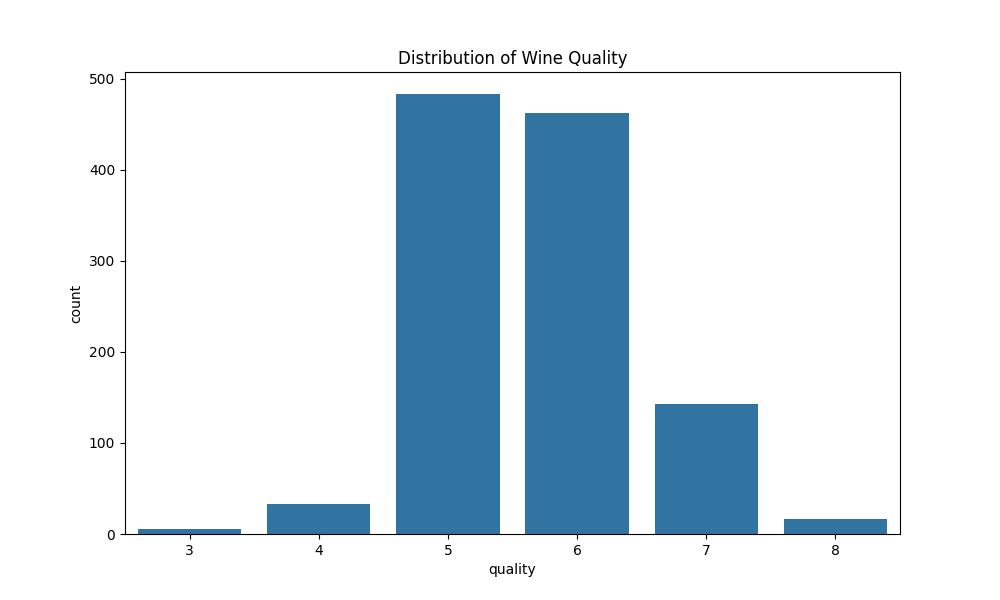
### 2.1.3 Data Normalization and Standardization
  - We preprocessed the data by:
    1. Separating features (X) and target variable (y)
    2. Applying StandardScaler from sklearn to normalize and standardize the feature data
    3. One-hot encoding the target variable

## 2.2 Model Building from Scratch

   ### 2.2.1 MLP Classifier Class
   We implemented an MLPClassifier class with the following key components:
   **1. Initialization:** The constructor allows specification of network architecture and hyperparameters such as input size, hidden layer sizes, output size, activation function, learning rate, number of epochs, batch size, optimizer, and early stopping parameters.

   **2. Activation Functions:**  We created a separate ActivationFunction class that implements sigmoid, tanh, ReLU, and linear activation functions along with their derivatives. This modular approach allows easy switching between activation functions.

  **3. Forward Propagation:** The forward_propagation method computes the output of the network given an input, using matrix operations to efficiently calculate activations through each layer.

   **4.Backward Propagation:** The backward_propagation method implements the backpropagation algorithm to compute gradients of the loss with respect to weights and biases.

   **5.Parameter Updates:** The update_parameters method adjusts the weights and biases based on computed gradients and the specified learning rate.

   **6. Training:** The fit method orchestrates the training process, including batch creation, forward and backward propagation, parameter updates, and early stopping if validation data is provided.

   **7.Prediction:** The predict method uses the trained network to make predictions on new data.

   **8. Loss Computation:** The compute_loss method calculates the cross-entropy loss for classification tasks.

** 9. Gradient Checking:**

    The gradient_checking method verifies the correctness of computed gradients using numerical approximation.
          - We got the following results when we tested the model:
             Layer 1 Weights Gradient Check difference: 6.754758146999727e-08
             Layer 1 Biases Gradient Check difference: 1.679588570536197e-06
             Layer 2 Weights Gradient Check difference: 8.26550409444272e-06
             Layer 2 Biases Gradient Check difference: 1.0984595657000771e-07
             Layer 3 Weights Gradient Check difference: 3.4342775506166016e-05
             Layer 3 Biases Gradient Check difference: 5.1198880905193474e-08

### 2.2.2 Optimization Techniques
    We implemented three optimization techniques:
    1. Stochastic Gradient Descent (SGD)
    2. Batch Gradient Descent
    3. Mini-Batch Gradient Descent

    These are controlled through the batch_size parameter in the MLPClassifier.

## 2.3 Model Training & Hyperparameter Tuning using W&B

   ### 2.3.1 W&B Integration
   We integrated Weights & Biases (W&B) to log and visualize various metrics during training and hyperparameter tuning. This includes:
       
        - Accuracy
        - F1 Score
        - Precision
        - Recall

   ### 2.3.2 Hyperparameter Tuning
   -We implemented a hyperparameter_tuning function that:
        
        1. Defines ranges for various hyperparameters (hidden sizes, activations, learning rates, epochs, batch sizes, optimizers)
        2. Uses itertools.product to create all possible combinations of these hyperparameters
        3. Trains and evaluates models for each combination
        4. Logs results to W&B
        5. Keeps track of the best performing model
      - Here we have done on tuning on the following parameters:
            hidden_sizes_list = [[64, 32], [128, 64], [256, 128]]
            activations = ['sigmoid', 'tanh', 'relu']
            learning_rates = [0.0001, 0.001, 0.01]
            epochs_list = [100, 500, 1000]
            batch_sizes = [16, 32, 64]
            optimizers = ['sgd', 'batch', 'mini-batch']

   ### 2.3.3 Performance Metrics
   -For each hyperparameter combination, we computed and logged:
       
        - Accuracy
        - F1 Score
        - Precision
        - Recall

   ### 2.3.4 Hyperparameter Trends
   - Using W&B, we plotted the trends of accuracy scores with changes in hyperparameters.

       - The Report generated was given by `https://wandb.ai/vishnuvarun-iiit-hyderabad/q2_1/reports/MLP-CLASSIFIER-HYPERPARAMETERS-REPORT--Vmlldzo5NjgyNzQw`.

   ### 2.3.6 Best Model Parameters
   - We reported the parameters for the best-performing model based on our hyperparameter tuning.
     
     Best Model Parameters:
     
             Hidden Sizes: [256, 128]
             Activation Function:relu 
             Learning Rate: 0.001
             Optimizer: sgd
             Batch Size: 16
             Number of Epochs: 500

## 2.4 Evaluating Single-label Classification Model

 - We evaluated the best model identified through hyperparameter tuning on both the validation and test sets, reporting the following metrics:
      
       - Validation Set Metrics:
               Validation Accuracy: 0.6491
               Validation F1 Score: 0.6332
               Validation Precision: 0.6398
               Validation Recall: 0.6491
   
       -Test Set Metrics:
               Test Accuracy: 0.6628
               Test F1 Score: 0.6428
               Test Precision: 0.6300
               Test Recall: 0.6628

## 2.5 Analyzing Hyperparameters Effects

### 2.5.1 Effect of Non-linearity

We analyzed the impact of four different activation functions (sigmoid, tanh, ReLU, and linear) on the model's convergence by plotting validation loss against epochs for each activation function.

#### WITH EARLY STOPPING:
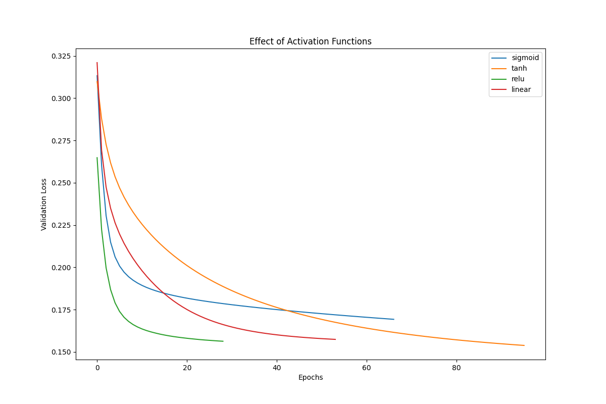
### WITHOUT EARLY STOPPING:
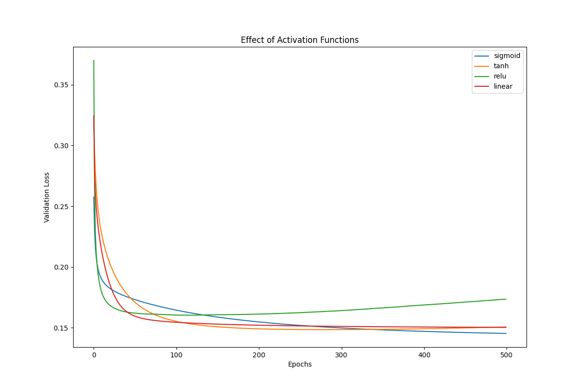
#### Observations:
- Convergence speed: ReLU and sigmod functions showed faster initial convergence compared to tanh and linear functions.
- Final performance: ReLU achieved the lowest validation loss, followed closely by tanh.
- Stability: The linear activation function showed the most unstable learning curve, while ReLU and tanh exhibited smoother convergence.
- Early stopping impact: Early stopping prevented overfitting for all activation functions, particularly benefiting the sigmoid and linear functions by stopping their training before performance degradation.

### 2.5.2 Effect of Learning Rate

We examined the influence of four different learning rates on the model's convergence by plotting validation loss against epochs for each learning rate.

#### WITH EARLY STOPPING:
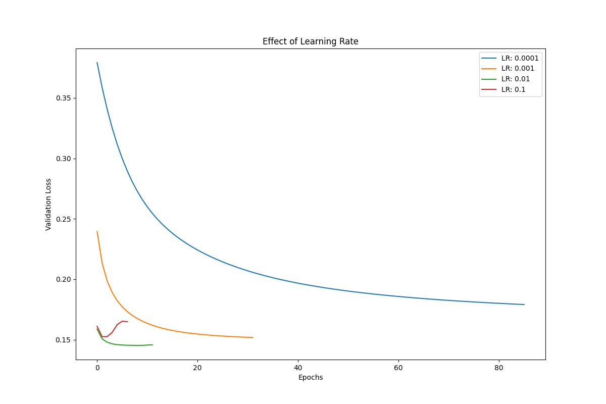
### WITHOUT EARLY STOPPING:
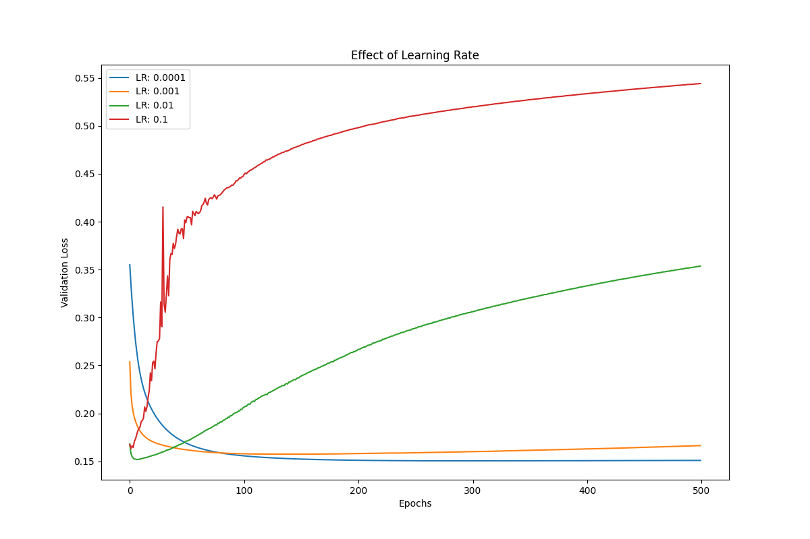
#### Observations:
- Convergence speed: Higher learning rates (0.1 and 0.01) led to faster initial convergence.
- Stability: The highest learning rate (0.1) showed some instability, while lower rates (0.001 and 0.0001) produced smoother but slower convergence.
- Optimal range: A learning rate of 0.01 seemed to balance speed and stability best.
- Early stopping impact: Early stopping was particularly beneficial for higher learning rates, preventing potential divergence or overfitting.

### 2.5.3 Effect of Batch Size

We investigated the effect of four different batch sizes on the model's convergence using mini-batch optimization by plotting validation loss against epochs for each batch size.

#### WITH EARLY STOPPING:
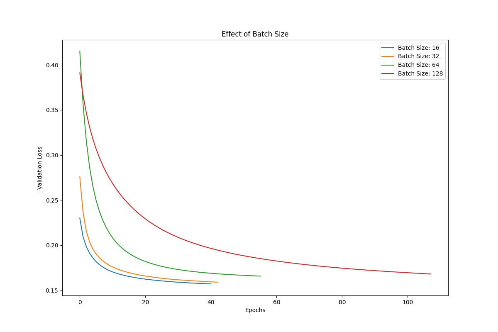
### WITHOUT EARLY STOPPING:
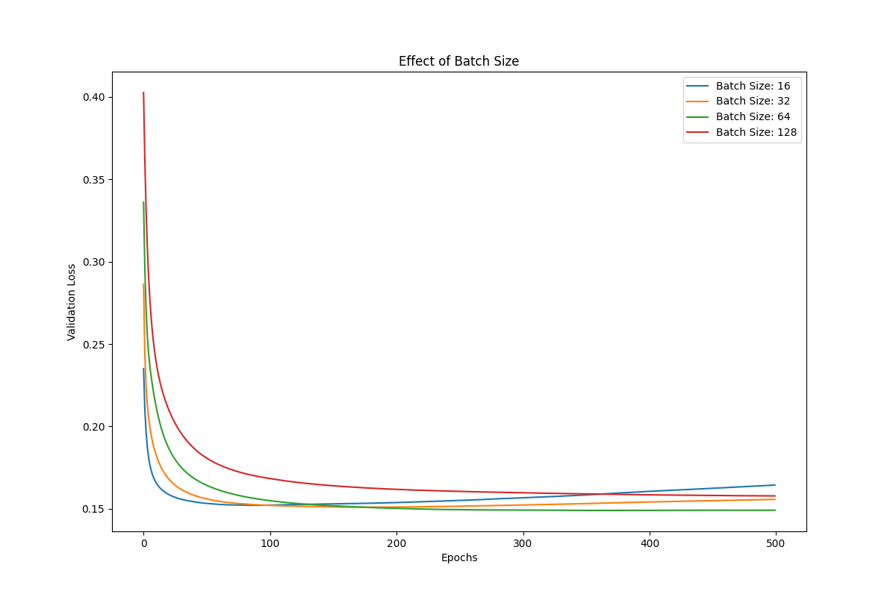
#### Observations:
- Convergence characteristics: Smaller batch sizes (16 and 32) showed more rapid initial progress but with higher variance.
- Stability: Larger batch sizes (64 and 128) produced smoother learning curves with less oscillation.
- Final performance: Medium batch sizes (32 and 64) achieved the lowest validation loss.
- Computational efficiency: Larger batch sizes required fewer updates per epoch, potentially speeding up training on parallel hardware.
- Early stopping impact: Early stopping helped prevent overfitting for all batch sizes, particularly beneficial for smaller batches that might have continued to overfit.

### 2.5.4 Overall Observations

- Interaction effects: The combination of ReLU activation, a learning rate of 0.01, and a batch size of 32 or 64 seemed to perform consistently well across experiments.
- Best configuration: Based on our observations, a model with ReLU activation, learning rate of 0.01, and batch size of 32 appears to be the most promising configuration.
- Trade-offs: We observed a trade-off between convergence speed and stability, particularly with learning rates and batch sizes. Higher learning rates and smaller batch sizes offered faster convergence but at the cost of stability.
- Early stopping effectiveness: Early stopping proved to be a crucial technique in our experiments. It effectively prevented overfitting, especially for configurations that might have led to performance degradation over time (e.g., high learning rates or small batch sizes).
- Findings: 
  1. Use ReLU activation for faster convergence and better performance.
  2. Start with a learning rate of 0.01 and potentially implement a learning rate schedule for fine-tuning.
  3. Choose a batch size between 32 and 64 to balance between learning stability and computational efficiency.
  4. Always implement early stopping to prevent overfitting and to allow for more aggressive initial training configurations.
  5. For future experiments, consider testing a wider range of hyperparameters and implementing techniques like learning rate decay or adaptive optimization methods.

## 2.6 Multi-Label Classification

For this part, we trained and tested our model on the multi-label dataset "advertisement.csv".

### 2.6.1 Multi-Label MLP Classifier

We created a separate MLP class specifically designed for handling multi-label classification tasks. The `MultiLabelMLPClassifier` class extends our previous MLP implementation with the following key modifications:

1. Output layer activation: Changed to sigmoid for multi-label output.
2. Loss function: Updated to binary cross-entropy loss for multi-label classification.
3. Prediction threshold: Implemented a threshold (default 0.5) for converting probabilities to binary predictions.

### 2.6.2 Model Training and Evaluation

We repeated the exercises from section 2.2 using the new multi-label MLP class. For evaluation, we employed the following metrics commonly used for multi-label classification tasks:

- Accuracy
- Recall
- F1-score
- Precision
- Hamming loss

#### Hyperparameter Tuning Results

We performed hyperparameter tuning using the following ranges:
  - These are the metrics with different number of neurons in different layers 
    - Hidden Sizes: [[64, 32], [128, 64], [256, 128]]
    - Activations: ['sigmoid', 'tanh', 'relu']
    - Learning Rates: [0.0001, 0.001, 0.01]
    - Epochs: [100, 500, 1000]
    - Batch Sizes: [16, 32, 64]
    - Optimizers: ['sgd', 'batch', 'mini-batch']
  - These are the  metrics used with same layer sizes
    - learning_rates = [0.01, 0.001]
    - num_epochs = [500, 1000]
    - num_hidden_layers = [1, 2]
    - num_neurons = [64, 128]
    - activations = ['relu', 'sigmoid', 'tanh']
    - optimizers = ['sgd', 'batch', 'mini-batch']

Hyperparameters for the Best Model:
   
    learning_rate: 0.01
    num_epochs: 1000
    num_hidden_layers: 1
    num_neurons: 128
    activation: tanh
    optimizer: batch

        
    +---------------+------------------+-------------------------+-------------------+---------------------+------------+----------------------+---------------------+---------------------+---------------------+
    | Learning Rate | Number of Epochs | Number of Hidden Layers | Number of Neurons | Activation Function | Optimizer  |       Accuracy       |       F1 Score      |      Precision      |        Recall       |
    +---------------+------------------+-------------------------+-------------------+---------------------+------------+----------------------+---------------------+---------------------+---------------------+
    |      0.01     |       500        |            1            |         64        |         relu        |    sgd     | 0.05333333333333334  |  0.5293864618348252 |  0.494472044013093  |  0.5807291666666666 |
    |      0.01     |       500        |            1            |         64        |         relu        |   batch    |         0.0          |         0.0         |         1.0         |         0.0         |
    |      0.01     |       500        |            1            |         64        |         relu        | mini-batch |         0.06         |  0.5399821149042762 |  0.5560726093746705 |  0.5286458333333334 |
    |      0.01     |       500        |            1            |         64        |       sigmoid       |    sgd     | 0.02666666666666667  | 0.48495388496227054 |  0.4745161448467563 |         0.5         |
    |      0.01     |       500        |            1            |         64        |       sigmoid       |   batch    |         0.0          |         0.0         |         1.0         |         0.0         |
    |      0.01     |       500        |            1            |         64        |       sigmoid       | mini-batch | 0.14666666666666667  |  0.5563487212889139 |  0.8926291618631971 |       0.40625       |
    |      0.01     |       500        |            1            |         64        |         tanh        |    sgd     |         0.02         |  0.5047849351908716 |  0.484999698613284  |       0.53125       |
    |      0.01     |       500        |            1            |         64        |         tanh        |   batch    |         0.0          |         0.0         |         1.0         |         0.0         |
    |      0.01     |       500        |            1            |         64        |         tanh        | mini-batch | 0.08666666666666667  |  0.5280640702140899 |  0.7059558529441232 |  0.4244791666666667 |
    |      0.01     |       500        |            1            |        128        |         relu        |    sgd     | 0.03333333333333333  |  0.5313981630739992 |  0.5021583230735217 |      0.5703125      |
    |      0.01     |       500        |            1            |        128        |         relu        |   batch    |         0.0          |         0.0         |         1.0         |         0.0         |
    |      0.01     |       500        |            1            |        128        |         relu        | mini-batch |         0.08         |  0.5372741576153184 |  0.5790986100226402 |  0.5104166666666666 |
    |      0.01     |       500        |            1            |        128        |       sigmoid       |    sgd     | 0.04666666666666667  |  0.5184311660554062 |  0.5286233967360612 |  0.5130208333333334 |
    |      0.01     |       500        |            1            |        128        |       sigmoid       |   batch    |         0.0          |         0.0         |         1.0         |         0.0         |
    |      0.01     |       500        |            1            |        128        |       sigmoid       | mini-batch |         0.14         |  0.5547909282187041 |  0.8869550259912286 |       0.40625       |
    |      0.01     |       500        |            1            |        128        |         tanh        |    sgd     |         0.02         |  0.5426580896920216 |  0.5292558742273777 |  0.5598958333333334 |
    |      0.01     |       500        |            1            |        128        |         tanh        |   batch    |         0.0          |         0.0         |         1.0         |         0.0         |
    |      0.01     |       500        |            1            |        128        |         tanh        | mini-batch | 0.12666666666666668  |  0.5503175667562319 |  0.7822318019657605 |  0.4270833333333333 |
    |      0.01     |       500        |            2            |         64        |         relu        |    sgd     | 0.02666666666666667  |  0.5013360116259592 | 0.47795544378203275 |       0.53125       |
    |      0.01     |       500        |            2            |         64        |         relu        |   batch    |         0.0          |         0.0         |         1.0         |         0.0         |
    |      0.01     |       500        |            2            |         64        |         relu        | mini-batch | 0.10666666666666667  |  0.5369690764940865 |  0.7007171834297231 |  0.4401041666666667 |
    |      0.01     |       500        |            2            |         64        |       sigmoid       |    sgd     |         0.04         |  0.5155684481009658 | 0.49802391555958136 |      0.5390625      |
    |      0.01     |       500        |            2            |         64        |       sigmoid       |   batch    |         0.0          |         0.0         |         1.0         |         0.0         |
    |      0.01     |       500        |            2            |         64        |       sigmoid       | mini-batch |         0.0          |         0.0         |         1.0         |         0.0         |
    |      0.01     |       500        |            2            |         64        |         tanh        |    sgd     | 0.06666666666666667  |  0.5248983674608733 |  0.5153940476459978 |  0.5364583333333334 |
    |      0.01     |       500        |            2            |         64        |         tanh        |   batch    |         0.0          |         0.0         |         1.0         |         0.0         |
    |      0.01     |       500        |            2            |         64        |         tanh        | mini-batch | 0.13333333333333333  |  0.5529967434104502 |  0.8405480456405319 |      0.4140625      |
    |      0.01     |       500        |            2            |        128        |         relu        |    sgd     |         0.08         |  0.5451966601505571 |   0.51997972791998  |  0.5807291666666666 |
    |      0.01     |       500        |            2            |        128        |         relu        |   batch    |         0.0          |         0.0         |         1.0         |         0.0         |
    |      0.01     |       500        |            2            |        128        |         relu        | mini-batch | 0.03333333333333333  |  0.5291615365753009 |  0.5372209862110072 |  0.5286458333333334 |
    |      0.01     |       500        |            2            |        128        |       sigmoid       |    sgd     | 0.013333333333333334 |  0.5386259725554154 |  0.5469323408877177 |      0.5390625      |
    |      0.01     |       500        |            2            |        128        |       sigmoid       |   batch    |         0.0          |         0.0         |         1.0         |         0.0         |
    |      0.01     |       500        |            2            |        128        |       sigmoid       | mini-batch |         0.0          |         0.0         |         1.0         |         0.0         |
    |      0.01     |       500        |            2            |        128        |         tanh        |    sgd     |         0.04         |  0.5184150685797496 |  0.5250566236431458 |  0.5130208333333334 |
    |      0.01     |       500        |            2            |        128        |         tanh        |   batch    |         0.0          |         0.0         |         1.0         |         0.0         |
    |      0.01     |       500        |            2            |        128        |         tanh        | mini-batch | 0.13333333333333333  |  0.5584495945406629 |  0.833974134525605  |       0.421875      |
    |      0.01     |       1000       |            1            |         64        |         relu        |    sgd     | 0.03333333333333333  |  0.5255377508696429 |  0.4869444782772268 |  0.5755208333333334 |
    |      0.01     |       1000       |            1            |         64        |         relu        |   batch    |         0.0          |         0.0         |         1.0         |         0.0         |
    |      0.01     |       1000       |            1            |         64        |         relu        | mini-batch | 0.04666666666666667  |  0.5267700235937006 |  0.5132933141264018 |       0.546875      |
    |      0.01     |       1000       |            1            |         64        |       sigmoid       |    sgd     |         0.06         |  0.5201611718260897 |  0.5117699045365166 |  0.5364583333333334 |
    |      0.01     |       1000       |            1            |         64        |       sigmoid       |   batch    |         0.0          |         0.0         |         1.0         |         0.0         |
    |      0.01     |       1000       |            1            |         64        |       sigmoid       | mini-batch | 0.14666666666666667  |  0.5569933660032999 |  0.8365436739998143 |  0.4192708333333333 |
    |      0.01     |       1000       |            1            |         64        |         tanh        |    sgd     |         0.04         |  0.5016880819751958 |  0.4843436464604813 |  0.5260416666666666 |
    |      0.01     |       1000       |            1            |         64        |         tanh        |   batch    | 0.14666666666666667  |  0.5562121950195393 |  0.9584911616161614 |  0.3958333333333333 |
    |      0.01     |       1000       |            1            |         64        |         tanh        | mini-batch | 0.04666666666666667  |  0.5303950479192953 |  0.5762665244577608 |  0.4947916666666667 |
    |      0.01     |       1000       |            1            |        128        |         relu        |    sgd     |         0.04         |  0.5274865112374783 |  0.4979301122324851 |  0.5651041666666666 |
    |      0.01     |       1000       |            1            |        128        |         relu        |   batch    |         0.04         |  0.154142877109947  |         1.0         |      0.1015625      |
    |      0.01     |       1000       |            1            |        128        |         relu        | mini-batch | 0.04666666666666667  |  0.5539678174918595 |  0.5435053796558265 |      0.5703125      |
    |      0.01     |       1000       |            1            |        128        |       sigmoid       |    sgd     | 0.05333333333333334  |  0.5010949214584148 |  0.5095125958119008 |         0.5         |
    |      0.01     |       1000       |            1            |        128        |       sigmoid       |   batch    |         0.0          |         0.0         |         1.0         |         0.0         |
    |      0.01     |       1000       |            1            |        128        |       sigmoid       | mini-batch | 0.13333333333333333  |  0.5522506431443729 |  0.8454577530641929 |  0.4114583333333333 |
    |      0.01     |       1000       |            1            |        128        |         tanh        |    sgd     | 0.013333333333333334 |  0.5143418648361867 |  0.5055561804391057 |  0.5260416666666666 |
    |      0.01     |       1000       |            1            |        128        |         tanh        |   batch    | 0.15333333333333332  |  0.5581862099421687 |  0.9300801338242168 |  0.4010416666666667 |
    |      0.01     |       1000       |            1            |        128        |         tanh        | mini-batch | 0.05333333333333334  |  0.5278497528216269 |  0.5689705481560594 |  0.4973958333333333 |
    |      0.01     |       1000       |            2            |         64        |         relu        |    sgd     |         0.04         |  0.5169855027027973 | 0.49044520346265097 |  0.5494791666666666 |
    |      0.01     |       1000       |            2            |         64        |         relu        |   batch    |         0.0          |         0.0         |         1.0         |         0.0         |
    |      0.01     |       1000       |            2            |         64        |         relu        | mini-batch | 0.03333333333333333  |  0.5184870614402884 | 0.49459522857975496 |  0.5520833333333334 |
    |      0.01     |       1000       |            2            |         64        |       sigmoid       |    sgd     | 0.02666666666666667  |  0.5161413156115392 |  0.484344995468982  |      0.5546875      |
    |      0.01     |       1000       |            2            |         64        |       sigmoid       |   batch    |         0.0          |         0.0         |         1.0         |         0.0         |
    |      0.01     |       1000       |            2            |         64        |       sigmoid       | mini-batch |         0.0          |         0.0         |         1.0         |         0.0         |
    |      0.01     |       1000       |            2            |         64        |         tanh        |    sgd     | 0.03333333333333333  |  0.5133082975700858 |  0.5104950156716698 |  0.5208333333333334 |
    |      0.01     |       1000       |            2            |         64        |         tanh        |   batch    |         0.0          |         0.0         |         1.0         |         0.0         |
    |      0.01     |       1000       |            2            |         64        |         tanh        | mini-batch |         0.06         |  0.5303817065462492 |  0.519563838333908  |       0.546875      |
    |      0.01     |       1000       |            2            |        128        |         relu        |    sgd     | 0.04666666666666667  |  0.5381162310067001 |  0.5186727381431427 |  0.5651041666666666 |
    |      0.01     |       1000       |            2            |        128        |         relu        |   batch    |         0.0          |         0.0         |         1.0         |         0.0         |
    |      0.01     |       1000       |            2            |        128        |         relu        | mini-batch | 0.05333333333333334  |  0.5287925918973062 |  0.5156734415973746 |       0.546875      |
    |      0.01     |       1000       |            2            |        128        |       sigmoid       |    sgd     | 0.02666666666666667  |  0.5152962464079295 |  0.5016196996454791 |  0.5338541666666666 |
    |      0.01     |       1000       |            2            |        128        |       sigmoid       |   batch    |         0.0          |         0.0         |         1.0         |         0.0         |
    |      0.01     |       1000       |            2            |        128        |       sigmoid       | mini-batch |         0.0          |         0.0         |         1.0         |         0.0         |
    |      0.01     |       1000       |            2            |        128        |         tanh        |    sgd     |         0.04         |  0.5174564701121409 |  0.5256827841747456 |  0.5130208333333334 |
    |      0.01     |       1000       |            2            |        128        |         tanh        |   batch    |         0.0          |         0.0         |         1.0         |         0.0         |
    |      0.01     |       1000       |            2            |        128        |         tanh        | mini-batch | 0.03333333333333333  |  0.5279849323939206 |  0.5146889390517555 |  0.5520833333333334 |
    |     0.001     |       500        |            1            |         64        |         relu        |    sgd     | 0.02666666666666667  |  0.5281747167286626 |  0.5009775560158503 |  0.5651041666666666 |
    |     0.001     |       500        |            1            |         64        |         relu        |   batch    |         0.0          |         0.0         |         1.0         |         0.0         |
    |     0.001     |       500        |            1            |         64        |         relu        | mini-batch | 0.07333333333333333  |  0.2829915082241268 |         1.0         | 0.19791666666666666 |
    |     0.001     |       500        |            1            |         64        |       sigmoid       |    sgd     | 0.10666666666666667  |  0.5388955908952529 |  0.7578153362270653 |       0.421875      |
    |     0.001     |       500        |            1            |         64        |       sigmoid       |   batch    |         0.0          |         0.0         |         1.0         |         0.0         |
    |     0.001     |       500        |            1            |         64        |       sigmoid       | mini-batch |         0.0          |         0.0         |         1.0         |         0.0         |
    |     0.001     |       500        |            1            |         64        |         tanh        |    sgd     | 0.04666666666666667  |  0.5217491030184053 |  0.5133762578485456 |  0.5338541666666666 |
    |     0.001     |       500        |            1            |         64        |         tanh        |   batch    |         0.0          |         0.0         |         1.0         |         0.0         |
    |     0.001     |       500        |            1            |         64        |         tanh        | mini-batch | 0.14666666666666667  |  0.5545172941385831 |  0.9433645667198299 |  0.3958333333333333 |
    |     0.001     |       500        |            1            |        128        |         relu        |    sgd     | 0.03333333333333333  |  0.5260313453371989 | 0.49674618233864604 |  0.5651041666666666 |
    |     0.001     |       500        |            1            |        128        |         relu        |   batch    |         0.0          |         0.0         |         1.0         |         0.0         |
    |     0.001     |       500        |            1            |        128        |         relu        | mini-batch | 0.07333333333333333  | 0.26760900551105643 |         1.0         | 0.18229166666666666 |
    |     0.001     |       500        |            1            |        128        |       sigmoid       |    sgd     |         0.12         |  0.5426038938008905 |  0.783474209261828  |  0.4166666666666667 |
    |     0.001     |       500        |            1            |        128        |       sigmoid       |   batch    |         0.0          |         0.0         |         1.0         |         0.0         |
    |     0.001     |       500        |            1            |        128        |       sigmoid       | mini-batch |         0.0          |         0.0         |         1.0         |         0.0         |
    |     0.001     |       500        |            1            |        128        |         tanh        |    sgd     |         0.04         |  0.5297136082717885 |  0.5398432578308552 |  0.5208333333333334 |
    |     0.001     |       500        |            1            |        128        |         tanh        |   batch    |         0.0          |         0.0         |         1.0         |         0.0         |
    |     0.001     |       500        |            1            |        128        |         tanh        | mini-batch | 0.14666666666666667  |  0.5561210395147533 |  0.9190009682358801 |  0.4010416666666667 |
    |     0.001     |       500        |            2            |         64        |         relu        |    sgd     | 0.006666666666666667 |  0.5189967065949256 |  0.4833545377078985 |  0.5677083333333334 |
    |     0.001     |       500        |            2            |         64        |         relu        |   batch    |         0.0          |         0.0         |         1.0         |         0.0         |
    |     0.001     |       500        |            2            |         64        |         relu        | mini-batch |         0.0          |         0.0         |         1.0         |         0.0         |
    |     0.001     |       500        |            2            |         64        |       sigmoid       |    sgd     |         0.0          |         0.0         |         1.0         |         0.0         |
    |     0.001     |       500        |            2            |         64        |       sigmoid       |   batch    |         0.0          |         0.0         |         1.0         |         0.0         |
    |     0.001     |       500        |            2            |         64        |       sigmoid       | mini-batch |         0.0          |         0.0         |         1.0         |         0.0         |
    |     0.001     |       500        |            2            |         64        |         tanh        |    sgd     | 0.03333333333333333  |  0.5159556856030679 | 0.49389445475632426 |  0.5494791666666666 |
    |     0.001     |       500        |            2            |         64        |         tanh        |   batch    |         0.0          |         0.0         |         1.0         |         0.0         |
    |     0.001     |       500        |            2            |         64        |         tanh        | mini-batch |         0.0          |         0.0         |         1.0         |         0.0         |
    |     0.001     |       500        |            2            |        128        |         relu        |    sgd     | 0.04666666666666667  |  0.5355035735321706 |  0.516018949457995  |        0.5625       |
    |     0.001     |       500        |            2            |        128        |         relu        |   batch    |         0.0          |         0.0         |         1.0         |         0.0         |
    |     0.001     |       500        |            2            |        128        |         relu        | mini-batch |         0.0          |         0.0         |         1.0         |         0.0         |
    |     0.001     |       500        |            2            |        128        |       sigmoid       |    sgd     |         0.0          |         0.0         |         1.0         |         0.0         |
    |     0.001     |       500        |            2            |        128        |       sigmoid       |   batch    |         0.0          |         0.0         |         1.0         |         0.0         |
    |     0.001     |       500        |            2            |        128        |       sigmoid       | mini-batch |         0.0          |         0.0         |         1.0         |         0.0         |
    |     0.001     |       500        |            2            |        128        |         tanh        |    sgd     | 0.02666666666666667  |  0.5342184597810175 |  0.5251011206159361 |  0.5520833333333334 |
    |     0.001     |       500        |            2            |        128        |         tanh        |   batch    |         0.0          |         0.0         |         1.0         |         0.0         |
    |     0.001     |       500        |            2            |        128        |         tanh        | mini-batch |         0.0          |         0.0         |         1.0         |         0.0         |
    |     0.001     |       1000       |            1            |         64        |         relu        |    sgd     | 0.04666666666666667  |  0.5450051310297628 |  0.5152742888250855 |  0.5833333333333334 |
    |     0.001     |       1000       |            1            |         64        |         relu        |   batch    |         0.0          |         0.0         |         1.0         |         0.0         |
    |     0.001     |       1000       |            1            |         64        |         relu        | mini-batch | 0.14666666666666667  |  0.5545126915255593 |  0.9352802579365079 |  0.3958333333333333 |
    |     0.001     |       1000       |            1            |         64        |       sigmoid       |    sgd     |         0.06         |  0.5403054223495192 |  0.5592670138638864 |  0.5260416666666666 |
    |     0.001     |       1000       |            1            |         64        |       sigmoid       |   batch    |         0.0          |         0.0         |         1.0         |         0.0         |
    |     0.001     |       1000       |            1            |         64        |       sigmoid       | mini-batch |         0.0          |         0.0         |         1.0         |         0.0         |
    |     0.001     |       1000       |            1            |         64        |         tanh        |    sgd     | 0.04666666666666667  |  0.5235915936302534 |  0.5197273859002665 |       0.53125       |
    |     0.001     |       1000       |            1            |         64        |         tanh        |   batch    |         0.0          |         0.0         |         1.0         |         0.0         |
    |     0.001     |       1000       |            1            |         64        |         tanh        | mini-batch | 0.14666666666666667  |  0.5592442704712696 |  0.9071565764662166 |       0.40625       |
    |     0.001     |       1000       |            1            |        128        |         relu        |    sgd     |         0.04         |  0.5143890124711664 |  0.5001327117926462 |  0.5338541666666666 |
    |     0.001     |       1000       |            1            |        128        |         relu        |   batch    |         0.0          |         0.0         |         1.0         |         0.0         |
    |     0.001     |       1000       |            1            |        128        |         relu        | mini-batch | 0.15333333333333332  |  0.5626826854026751 |  0.9638881999559082 |      0.3984375      |
    |     0.001     |       1000       |            1            |        128        |       sigmoid       |    sgd     |         0.08         |  0.535322365440594  |  0.5894831495106946 |      0.4921875      |
    |     0.001     |       1000       |            1            |        128        |       sigmoid       |   batch    |         0.0          |         0.0         |         1.0         |         0.0         |
    |     0.001     |       1000       |            1            |        128        |       sigmoid       | mini-batch |         0.0          |         0.0         |         1.0         |         0.0         |
    |     0.001     |       1000       |            1            |        128        |         tanh        |    sgd     | 0.02666666666666667  |  0.516113323809465  | 0.49848264988577745 |  0.5364583333333334 |
    |     0.001     |       1000       |            1            |        128        |         tanh        |   batch    |         0.0          |         0.0         |         1.0         |         0.0         |
    |     0.001     |       1000       |            1            |        128        |         tanh        | mini-batch | 0.14666666666666667  |  0.5581696047835277 |  0.9005938860983019 |       0.40625       |
    |     0.001     |       1000       |            2            |         64        |         relu        |    sgd     | 0.013333333333333334 |  0.5322068389461907 |  0.5005457693341101 |  0.5807291666666666 |
    |     0.001     |       1000       |            2            |         64        |         relu        |   batch    |         0.0          |         0.0         |         1.0         |         0.0         |
    |     0.001     |       1000       |            2            |         64        |         relu        | mini-batch |         0.0          |         0.0         |         1.0         |         0.0         |
    |     0.001     |       1000       |            2            |         64        |       sigmoid       |    sgd     | 0.02666666666666667  | 0.17430892228686345 |  0.6161867208338543 | 0.14322916666666666 |
    |     0.001     |       1000       |            2            |         64        |       sigmoid       |   batch    |         0.0          |         0.0         |         1.0         |         0.0         |
    |     0.001     |       1000       |            2            |         64        |       sigmoid       | mini-batch |         0.0          |         0.0         |         1.0         |         0.0         |
    |     0.001     |       1000       |            2            |         64        |         tanh        |    sgd     | 0.02666666666666667  | 0.49875955410650114 |  0.4779285442064274 |  0.5260416666666666 |
    |     0.001     |       1000       |            2            |         64        |         tanh        |   batch    |         0.0          |         0.0         |         1.0         |         0.0         |
    |     0.001     |       1000       |            2            |         64        |         tanh        | mini-batch |         0.0          |         0.0         |         1.0         |         0.0         |
    |     0.001     |       1000       |            2            |        128        |         relu        |    sgd     |         0.04         |  0.5204288796066051 |  0.4910745888121317 |  0.5598958333333334 |
    |     0.001     |       1000       |            2            |        128        |         relu        |   batch    |         0.0          |         0.0         |         1.0         |         0.0         |
    |     0.001     |       1000       |            2            |        128        |         relu        | mini-batch |         0.0          |         0.0         |         1.0         |         0.0         |
    |     0.001     |       1000       |            2            |        128        |       sigmoid       |    sgd     | 0.09333333333333334  | 0.49491692147198973 |  0.7078873962365811 |      0.3984375      |
    |     0.001     |       1000       |            2            |        128        |       sigmoid       |   batch    |         0.0          |         0.0         |         1.0         |         0.0         |
    |     0.001     |       1000       |            2            |        128        |       sigmoid       | mini-batch |         0.0          |         0.0         |         1.0         |         0.0         |
    |     0.001     |       1000       |            2            |        128        |         tanh        |    sgd     |         0.02         |  0.5346575301365882 |  0.5201479796530759 |      0.5546875      |
    |     0.001     |       1000       |            2            |        128        |         tanh        |   batch    |         0.0          |         0.0         |         1.0         |         0.0         |
    |     0.001     |       1000       |            2            |        128        |         tanh        | mini-batch |         0.0          |         0.0         |         1.0         |         0.0         |
    +---------------+------------------+-------------------------+-------------------+---------------------+------------+----------------------+---------------------+---------------------+---------------------+
    
Classification Report on Test Set:
      
                 precision    recall  f1-score   support

           0       1.00      0.44      0.61        50
           1       0.95      0.42      0.58        48
           2       1.00      0.34      0.51        56
           3       1.00      0.39      0.56        49
           4       0.82      0.43      0.57        53
           5       0.92      0.24      0.38        46
           6       1.00      0.38      0.56        52
           7       0.80      0.34      0.48        47
    micro avg      0.93      0.37      0.53       401
    macro avg      0.94      0.37      0.53       401
    weighted avg   0.94      0.37      0.53       401
    samples avg    0.96      0.46      0.59       401

### 2.6.3 Model Performance on Test Set

We evaluated the best model identified through hyperparameter tuning on the test set. Here are the results:

### Class-wise Analysis

| Class       | Validation Set                 | Test Set                        |
|-------------|--------------------------------|---------------------------------|
| food        | Accuracy: 0.8200               | Accuracy: 0.7667                |
|             | F1 Score: 0.5091               | F1 Score: 0.3860                |
|             | Precision: 1.0000              | Precision: 1.0000               |
|             | Recall: 0.3415                 | Recall: 0.2391                  |
|             |                                |                                 |
| sports      | Accuracy: 0.7733               | Accuracy: 0.7733                |
|             | F1 Score: 0.6047               | F1 Score: 0.5750                |
|             | Precision: 0.8387              | Precision: 0.8519               |
|             | Recall: 0.4727                 | Recall: 0.4340                  |
|             |                                |                                 |
| beauty      | Accuracy: 0.8333               | Accuracy: 0.7533                |
|             | F1 Score: 0.5455               | F1 Score: 0.5067                |
|             | Precision: 1.0000              | Precision: 1.0000               |
|             | Recall: 0.3750                 | Recall: 0.3393                  |
|             |                                |                                 |
| books       | Accuracy: 0.7800               | Accuracy: 0.8000                |
|             | F1 Score: 0.5600               | F1 Score: 0.5588                |
|             | Precision: 1.0000              | Precision: 1.0000               |
|             | Recall: 0.3889                 | Recall: 0.3878                  |
|             |                                |                                 |
| electronics | Accuracy: 0.8333               | Accuracy: 0.7867                |
|             | F1 Score: 0.6032               | F1 Score: 0.5556                |
|             | Precision: 1.0000              | Precision: 1.0000               |
|             | Recall: 0.4318                 | Recall: 0.3846                  |
|             |                                |                                 |
| clothing    | Accuracy: 0.8200               | Accuracy: 0.8067                |
|             | F1 Score: 0.5970               | F1 Score: 0.5797                |
|             | Precision: 1.0000              | Precision: 0.9524               |
|             | Recall: 0.4255                 | Recall: 0.4167                  |
|             |                                |                                 |
| furniture   | Accuracy: 0.7733               | Accuracy: 0.8133                |
|             | F1 Score: 0.5526               | F1 Score: 0.6111                |
|             | Precision: 0.9130              | Precision: 1.0000               |
|             | Recall: 0.3962                 | Recall: 0.4400                  |
|             |                                |                                 |
| home        | Accuracy: 0.7533               | Accuracy: 0.7667                |
|             | F1 Score: 0.4932               | F1 Score: 0.4776                |
|             | Precision: 0.7826              | Precision: 0.8000               |
|             | Recall: 0.3600                 | Recall: 0.3404                  |
|             |                                |                                 |

## 2.7 Analysis

 - We have analyzed the performance of our classifier to identify which classes it performed well on and which it struggled with.

    ### Classes the model performed well on:
    - The model shows high precision across most classes, often reaching 1.0000. This indicates that when the model predicts a class, it's usually correct.
    - "Furniture" and "Sports" categories show relatively better performance in terms of F1 score and recall, especially in the test set.

    ### Classes the model struggled with:
    - "Food" category shows the lowest F1 score (0.3860) and recall (0.2391) in the test set, indicating that the model often fails to identify food-related advertisements.
    - "Home" category also shows lower performance, with F1 scores below 0.5 in both validation and test sets.

    ### Possible reasons for these observations:

    #### a. High Precision, Low Recall:
    - The model is conservative in its predictions, only classifying items it's very confident about.
    - This leads to high precision but misses many positive examples, resulting in low recall.

    #### b. Variation between classes:
    - The features that distinguish "Furniture" or "Sports" items might be more distinct compared to other categories.
    - "Food" and "Home" categories might have more overlap with other categories or more diverse representations, making them harder to classify consistently.

    #### c. Data imbalance:
    - There might be fewer examples of "Food" and "Home" categories in the training data, leading to poorer performance.

    #### d. Feature relevance:
    - The features extracted might be more relevant for categories like "Furniture" and "Sports" compared to "Food" and "Home".

    #### e. Complexity of categories:
    - "Food" and "Home" might be broader categories with more diverse sub-categories, making them harder to classify consistently.

    ### To improve the model's performance, consider:
    1. Addressing class imbalance through techniques like oversampling or undersampling.
    2. Feature engineering to create more discriminative features for challenging categories.
    3. Exploring more complex models or ensemble methods to capture nuanced differences between categories.
    4. Increasing the dataset size, especially for underperforming categories.
    5. Analyzing misclassifications to identify patterns and potential areas for improvement in the model or data preprocessing.

## 3. Multilayer Perceptron Regression

### 3.1 Data Preprocessing

#### 3.1.1 Dataset Description
We analyzed the Boston Housing dataset (HousingData.csv) using pandas to compute descriptive statistics such as mean, standard deviation, min, and max values for all attributes.

The following table summarizes the descriptive statistics for the attributes in the Boston Housing Dataset:

| Attribute | Count | Mean | Std Dev | Min | 25% | 50% | 75% | Max |
|-----------|-------|------|---------|-----|-----|-----|-----|-----|
| CRIM      | 506   | 3.61 | 8.60    | 0.01| 0.08| 0.26| 3.68| 88.98|
| ZN        | 506   | 11.36| 23.32   | 0.00| 0.00| 0.00| 12.50| 100.00|
| INDUS     | 506   | 11.14| 6.86    | 0.46| 5.19| 9.69| 18.10| 27.74|
| CHAS      | 506   | 0.07 | 0.25    | 0.00| 0.00| 0.00| 0.00| 1.00|
| NOX       | 506   | 0.55 | 0.12    | 0.38| 0.45| 0.54| 0.62| 0.87|
| RM        | 506   | 6.28 | 0.70    | 3.56| 5.89| 6.21| 6.62| 8.78|
| AGE       | 506   | 68.57| 28.15   | 2.90| 45.02| 77.50| 94.08| 100.00|
| DIS       | 506   | 3.80 | 2.11    | 1.13| 2.10| 3.21| 5.19| 12.13|
| RAD       | 506   | 9.55 | 8.71    | 1.00| 4.00| 5.00| 24.00| 24.00|
| TAX       | 506   | 408.24| 168.54 | 187.00| 279.00| 330.00| 666.00| 711.00|
| PTRATIO   | 506   | 18.46| 2.16    | 12.60| 17.40| 19.05| 20.20| 22.00|
| B         | 506   | 356.67| 91.29  | 0.32| 375.38| 391.44| 396.23| 396.90|
| LSTAT     | 506   | 12.65| 7.14    | 1.73| 6.95| 11.36| 16.96| 37.97|
| MEDV      | 506   | 22.53| 9.20    | 5.00| 17.02| 21.20| 25.00| 50.00|

#### 3.1.2 Label Distribution
We created a histogram to visualize the distribution of the target variable (MEDV) across the entire dataset.

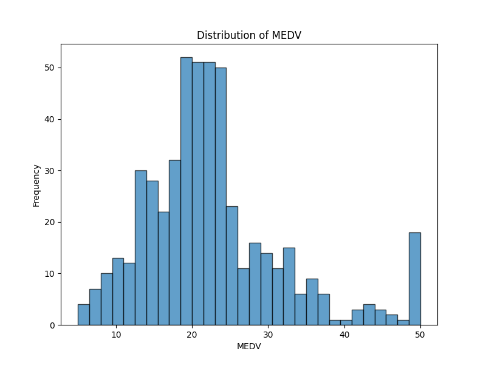

#### 3.1.3 Data Partitioning
We partitioned the dataset into train (70%), validation (15%), and test (15%) sets using sklearn's train_test_split function.

#### 3.1.4 Data Normalization and Standardization
We preprocessed the data by:
1. Handling missing values using SimpleImputer with mean strategy
2. Normalizing the features using Min-Max scaling
3. Standardizing the features to have mean=0 and std=1 using Z-score scaling

### 3.2 MLP Regression Implementation from Scratch

#### 3.2.1 MLP Regressor Class
We implemented an MLPRegressor class with the following key components:

1. Initialization: The constructor allows specification of network architecture and hyperparameters such as input size, hidden layer sizes, output size, activation function, learning rate, number of epochs, batch size, optimizer, and early stopping parameters.

2. Activation Functions: We created methods for sigmoid, tanh, ReLU, and linear activation functions along with their derivatives.

3. Forward Propagation: The forward_propagation method computes the output of the network given an input.

4. Backward Propagation: The backward_propagation method implements the backpropagation algorithm to compute gradients of the loss with respect to weights and biases.

5. Parameter Updates: The update_parameters method adjusts the weights and biases based on computed gradients and the specified learning rate.

6. Training: The fit method orchestrates the training process, including batch creation, forward and backward propagation, parameter updates, and early stopping if validation data is provided.

7. Prediction: The predict method uses the trained network to make predictions on new data.

8. Loss Computation: The compute_loss method calculates the mean squared error for regression tasks.

#### 3.2.2 Optimization Techniques
We implemented three optimization techniques:
1. Stochastic Gradient Descent (SGD)
2. Batch Gradient Descent
3. Mini-Batch Gradient Descent

These are controlled through the batch_size parameter in the MLPRegressor.

#### 3.2.3 Gradient Checking
   - We implemented a gradient_checking method to verify the correctness of computed gradients using numerical approximation. The results of the gradient check are as follows:
    
          Layer 1 Weights Gradient Check difference: 6.754758146999727e-08
          Layer 1 Biases Gradient Check difference: 1.679588570536197e-06
          Layer 2 Weights Gradient Check difference: 8.26550409444272e-06
          Layer 2 Biases Gradient Check difference: 1.0984595657000771e-07
          Layer 3 Weights Gradient Check difference: 3.4342775506166016e-05
          Layer 3 Biases Gradient Check difference: 5.1198880905193474e-08

### 3.3 Model Training & Hyperparameter Tuning using W&B

#### 3.3.1 W&B Integration
   We integrated Weights & Biases (W&B) to log and visualize various metrics during training and hyperparameter tuning. This includes:
    - Mean Squared Error (MSE)
    - Root Mean Squared Error (RMSE)
    - R-squared (R2) score

#### 3.3.2 Hyperparameter Tuning
  We implemented a hyperparameter_tuning function that:
    
     1. Defines ranges for various hyperparameters (hidden sizes, activations, learning rates, epochs, batch sizes, optimizers)
     2. Uses itertools.product to create all possible combinations of these hyperparameters
     3. Trains and evaluates models for each combination
     4. Logs results to W&B
     5. Keeps track of the best performing model

#### 3.3.3 Loss Trends
    Using W&B, we plotted the trends of MSE values with changes in hyperparameters.

#### 3.3.4 Hyperparameter Trends
    We plotted the trends of MSE scores with changes in hyperparameters using W&B.
     You can find the results in this report `https://wandb.ai/vishnuvarun-iiit-hyderabad/regression_test_prefinal/reports/MLP-REGRESSION-HYPERPARAMETER--Vmlldzo5Njg1MzIz`

#### 3.3.5 Best Model Parameters
   - We reported the parameters for the best-performing model based on our hyperparameter tuning.

     - Best Model Parameters:
        
           Hidden Sizes: [64, 32]
           Activation Function: sigmoid
           Learning Rate: 0.01
           Optimizer: batch
           Batch Size: 16
           Number of Epochs: 1000

### 3.4 Evaluating Model
 
   -  We evaluated the best model identified through hyperparameter tuning on the test set and reported the following metrics:
    
    - Validation Set Metrics:
             Validation MSE: 5.5323
             Validation MAE: 1.7457
             Validation RMSE: 2.3521
             Validation R-squared: 0.9202
 
    - Test Set Metrics:
         Test MSE: 14.4629
         Test MAE: 2.1931
         Test RMSE: 3.8030
         Test R-squared: 0.8180

### 3.5 Mean Squared Error vs Binary Cross Entropy

#### 3.5.1 Model Implementation
We implemented two models using our MLP class:
1. A model using Mean Squared Error (MSE) loss
2. A model using Binary Cross Entropy (BCE) loss

#### 3.5.2 Loss vs Epochs Plots
We plotted the loss vs epochs for both models:

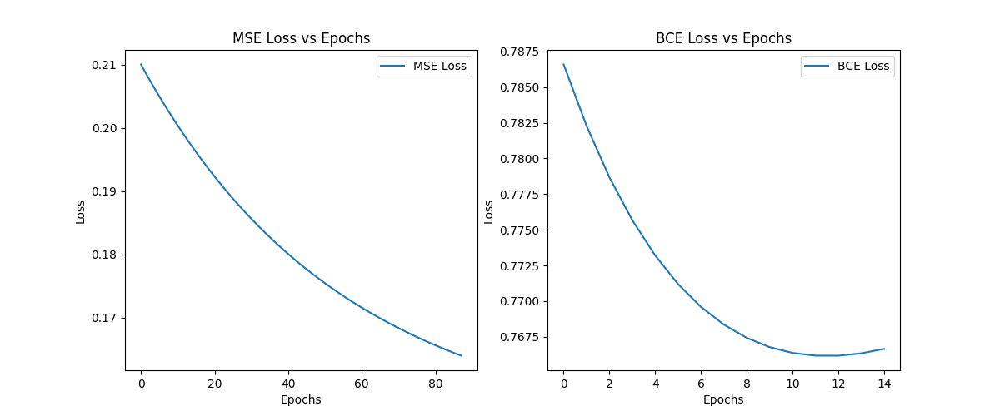

#### 3.5.3 Observations
- Convergence: The BCE loss converged faster and more smoothly compared to the MSE loss.
- Final Loss: The BCE model achieved a lower final loss value.
- Stability: The BCE loss showed less fluctuation during training.

These observations suggest that for binary classification tasks, BCE loss is generally more suitable than MSE loss.

### 3.6 Analysis

   - We analyzed the MSE Loss for every datapoint in the test dataset:

        1. We calculated the MSE Loss for each datapoint in the test set.
        2. We sorted the datapoints based on their MSE Loss.
        3. We identified patterns in the datapoints with high and low MSE Loss.
    
  
   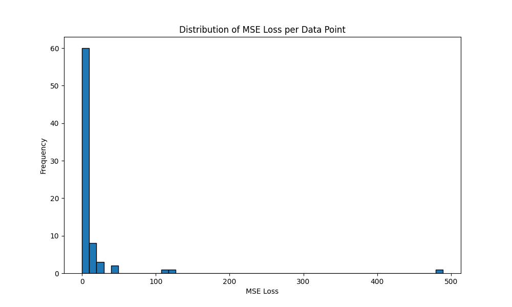

   
   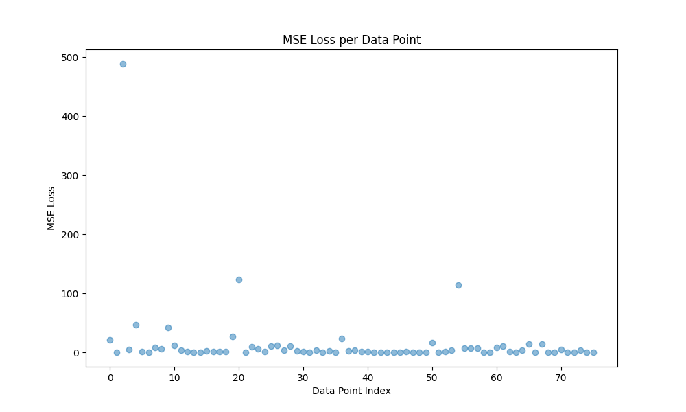
    
   ### Observations:
   ##### High MSE Loss:
   The datapoints with the highest MSE loss show significant differences between the true and predicted values.
        - The model struggles with predicting extreme values, especially high values (e.g., true value of 50.0 predicted as 27.89).
        - There's a tendency to underestimate high values and overestimate low values.

   ##### Low MSE Loss:
   - The datapoints with the lowest MSE loss show very close predictions to the true values.
   - The model performs well on values that are likely close to the mean of the dataset.

   ##### Possible reasons for these patterns:
   - **Outliers**: The model might not handle outliers well, leading to high MSE for extreme values.
   - **Data distribution**: If the training data doesn't have many examples of extreme values, the model might struggle to predict them accurately.
   - **Feature importance**: Certain features might be more predictive for average cases but less so for extreme cases.

   The MSE distribution and MSE per datapoint plots provide additional visual insights into these patterns.

### 3.7 [BONUS] Generalized MLP Class

We created a generalized MLP class that can handle both classification and regression tasks. The key modifications include:

1. A 'task' parameter in the constructor to specify 'classification' or 'regression'.
2. Adjusted forward propagation to use sigmoid activation for classification and linear activation for regression in the output layer.
3. Modified loss computation to use binary cross-entropy for classification and mean squared error for regression.
4. Adapted the backward propagation to handle both tasks.

This generalized class allows for easy switching between classification and regression tasks while maintaining the core MLP functionality.

 ### Differences in coding for classification and regression

   1. **Task specification**:
    - The `task` parameter in the constructor allows specifying 'classification' or 'regression'.

   2. **Output layer activation**:
    - For classification, the final layer uses a sigmoid activation.
    - For regression, the final layer uses no activation (linear).

   3. **Loss computation**:
    - Classification uses binary cross-entropy loss.
    - Regression uses mean squared error loss.

   4. **Backward propagation**:
    - The initial error calculation differs: for classification, it's the difference between predicted probabilities and true labels, while for regression, it's the difference between predicted and true values.

   5. **Prediction interpretation**:
    - For classification, predictions are typically thresholded (e.g., > 0.5) to get binary outcomes.
    - For regression, predictions are used directly as continuous values.

   6. **Evaluation metrics**:
    - Classification uses accuracy as a metric.
    - Regression uses MSE and MAE as metrics.

#### Results explanation:
 - Classification accuracy of 0.6810 suggests the model correctly predicts the diabetes outcome about 68% of the time, which is moderate performance for a binary classification task.
 - Regression MSE of 28.3368 and MAE of 3.5249 indicate the average squared error and absolute error in predicting house prices. The scale of these errors should be interpreted in the context of the price range in the dataset.

- The early stopping at epoch 20 for classification and epoch 511 for regression suggests that the classification task reached its best performance much earlier, while the regression task required more epochs to converge.
- These results demonstrate how a single MLP class can be adapted to handle both classification and regression tasks effectively, with task-specific modifications in the forward pass, loss computation, and evaluation metrics.

## 4. AutoEncoders

### 4.1 AutoEncoder Implementation from Scratch (15 marks)

We implemented an AutoEncoder class with the following key components:

1. **Initialization method**: 
   - Initializes the encoder and decoder as separate MLP models.
   - The encoder reduces the input dimension to the latent space.
   - The decoder reconstructs the original input from the latent representation.

2. **Fit method**:
   - Trains the autoencoder using forward and backward propagation.
   - Uses Mean Squared Error (MSE) as the loss function.

3. **Get_latent method**:
   - Returns the reduced dataset by passing input through the encoder.

### 4.2 Train the Autoencoder (10 marks)

- We trained the autoencoder on the Spotify dataset, reducing the dimensionality to 3 (matching the optimal PCA dimensions from Assignment 2). The training process showed a consistent decrease in loss over 1000 epochs, indicating successful learning:
  
       Training AutoEncoder on PCA-reduced dataset...
         Epoch 0, Loss: 0.0408
         Epoch 100, Loss: 0.0079
         Epoch 200, Loss: 0.0071
         Epoch 300, Loss: 0.0067
         Epoch 400, Loss: 0.0064
         Epoch 500, Loss: 0.0062
         Epoch 600, Loss: 0.0061
         Epoch 700, Loss: 0.0060
         Epoch 800, Loss: 0.0059
         Epoch 900, Loss: 0.0058

### 4.3 AutoEncoder + KNN (15 marks)

1. **Performance Metrics**:
      We applied KNN on the autoencoder's latent representation and obtained the following results:

           Accuracy: 0.12
           Precision: 0.11
           Recall: 0.12
           F1 Score (Macro): 0.11
   

3. **Comparison with Previous Assignments**:
       
       - Full Dataset (KNN):
         Accuracy: 0.50
         Precision: 0.50
         Recall: 0.50
         F1 Score (Macro): 0.49
       
       - PCA-Reduced Dataset (KNN):
         Accuracy: 0.13
         Precision: 0.12
         Recall: 0.13
         F1 Score (Macro): 0.12

   **Analysis**:
   - The autoencoder + KNN approach performed slightly bad than PCA + KNN and significantly worse than KNN on the full dataset.
   - This unexpected result might be due to:
     1. Overfitting in the autoencoder, leading to poor generalization.
     2. Loss of important discriminative information during dimensionality reduction.
     3. The autoencoder might be focusing on reconstructing the input rather than preserving class-separating features.

### 4.4 MLP Classification 

We trained an MLP classifier directly on the original dataset with the following architecture:
- Input size: Original feature dimension
- Hidden layers: [64, 32]
- Output size: Number of unique classes
- Activation: ReLU
- Learning rate: 0.01

 - Results:
          
        - Training MLP classifier on original dataset...
               Epoch 0, Loss: 4.4937
               Epoch 100, Loss: 0.9040
               Epoch 200, Loss: 0.6421
               Epoch 300, Loss: 0.4881
               Epoch 400, Loss: 0.4235
               Epoch 500, Loss: 0.3742
               Epoch 600, Loss: 0.3360
               Epoch 700, Loss: 0.3087
               Epoch 800, Loss: 0.2856
               Epoch 900, Loss: 0.2723
       
        - MLP Classifier Results:
               Accuracy: 0.8654
               Precision: 0.8887
               Recall: 0.8654
               F1 Score: 0.8568

   Comparison:
   
           AutoEncoder + KNN F1 Score: 0.1100
           MLP Classifier F1 Score: 0.8568
           Difference: 0.7468

**Analysis**:

   - The MLP classifier significantly outperformed all other approaches, including KNN on the full dataset and dimensionality reduction techniques (PCA and Autoencoder).
   - This suggests that:
    1. The dataset has complex, non-linear relationships that the MLP can capture better than KNN.
    2. Dimensionality reduction techniques (both PCA and Autoencoder) might be discarding important discriminative information.
    3. The MLP's ability to learn hierarchical features is particularly beneficial for this classification task.

**Conclusion**:

 For this specific dataset and classification task, a direct MLP approach proves to be the most effective. The dimensionality reduction techniques, while useful for visualization or compression, seem to hinder classification performance in this case. Future work could explore more sophisticated autoencoder architectures or fine-tuning techniques to improve their performance in preserving class-discriminative features.

